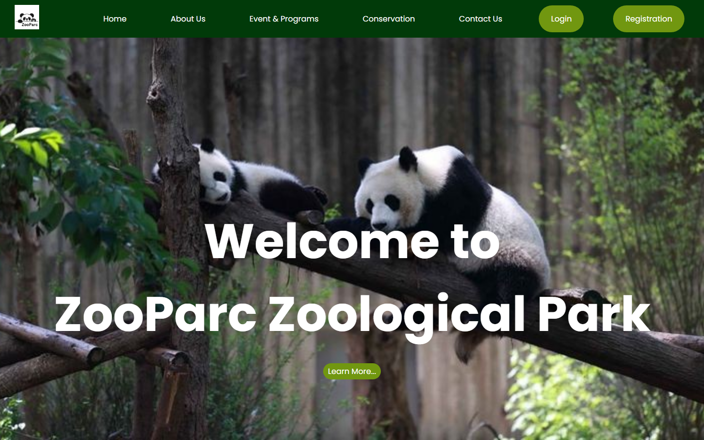
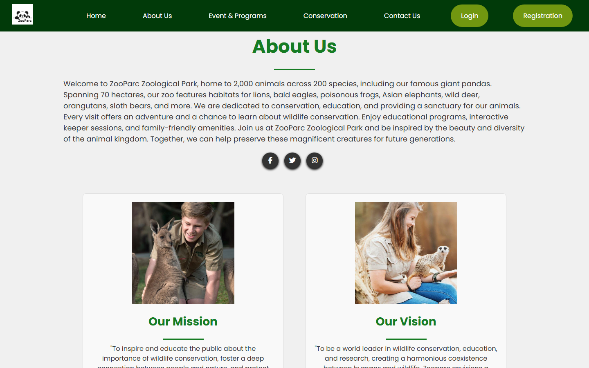
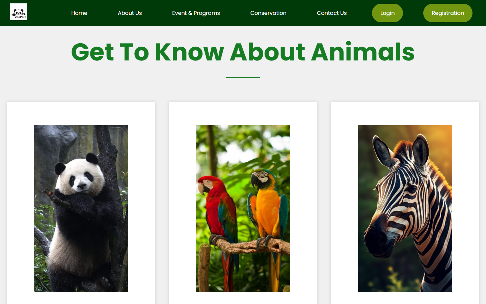
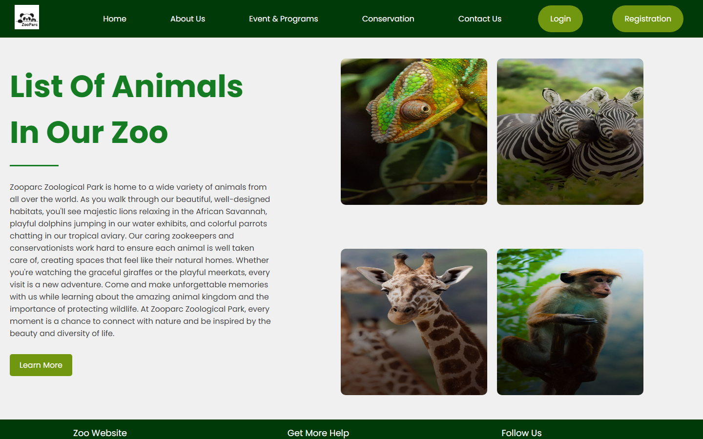
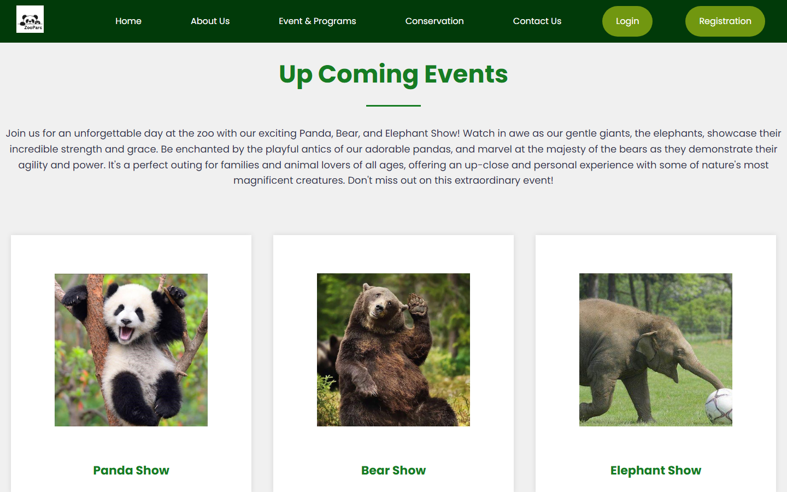
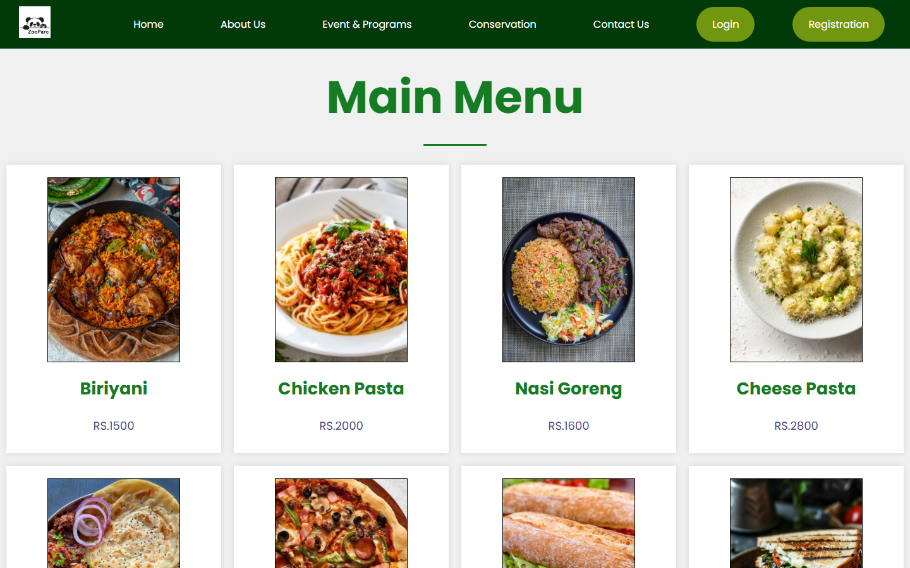
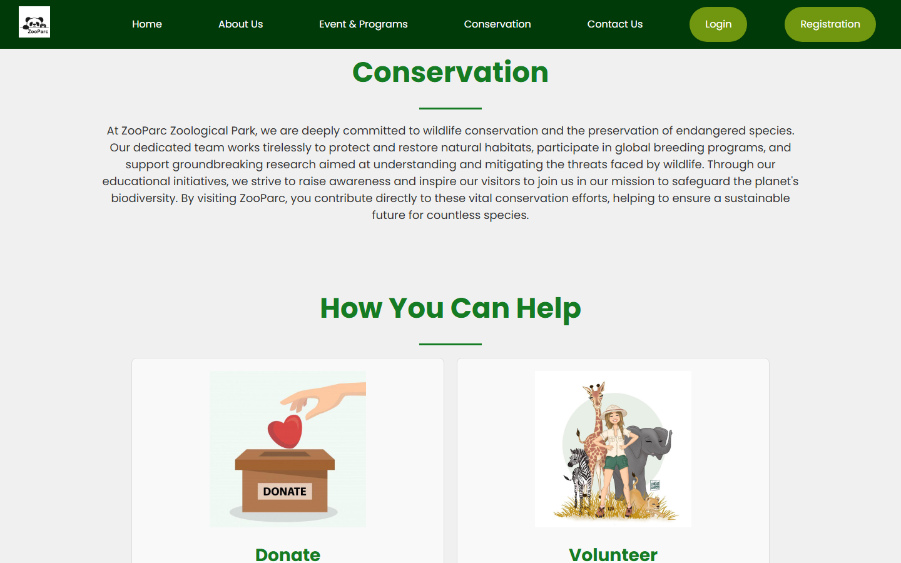
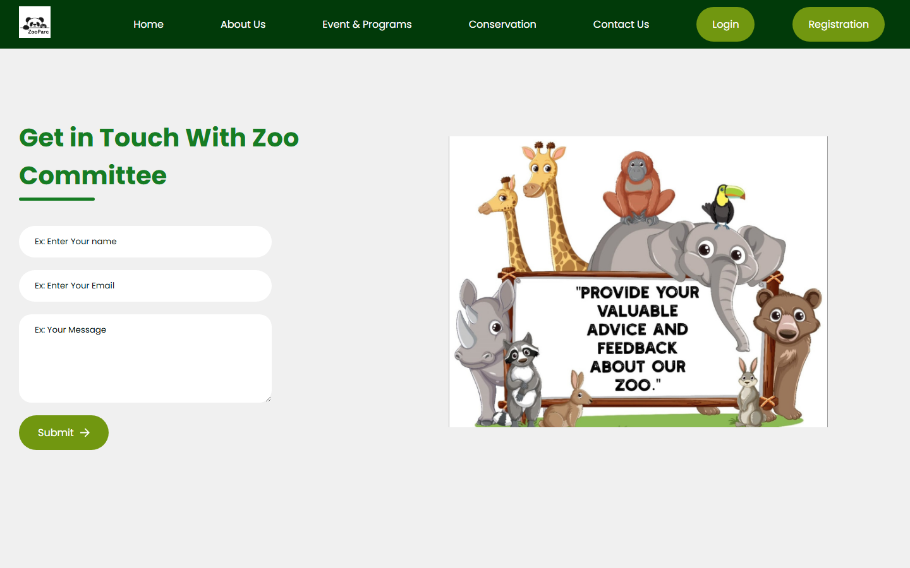
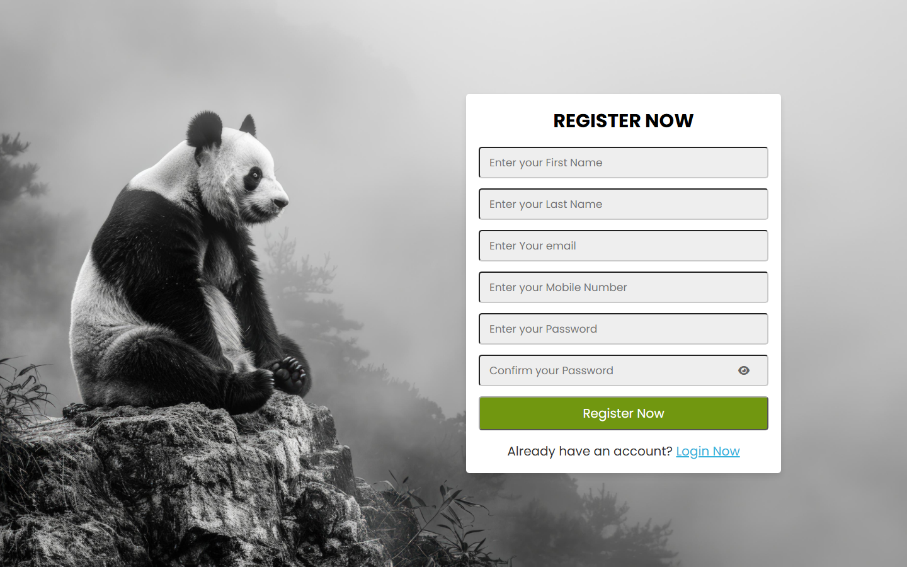
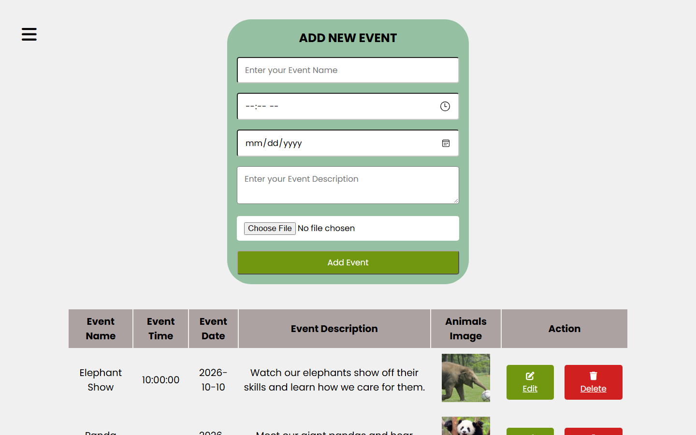

# ZooParc – Zoo Management Website

An interactive zoo website for exploring animals, learning about them, and viewing special event schedules. Visitors can browse animals, events, programs, food and the gallery, and register for an account. Administrators get a dashboard for managing events and programs.

Built with PHP, MySQL, HTML, CSS and JavaScript (jQuery).

## Screenshots

| About Us | Animals |
|---|---|
|  |  |
| **Gallery** | **Upcoming Events** |
|  |  |
| **Food Menu** | **Conservation** |
|  |  |
| **Contact Us** | **Registration** |
|  |  |
| **Admin Login** | **Admin – Manage Events** |
|  |  |

## Features

### Visitor site
- **Home, About Us, Conservation**: information about the zoo and its conservation work
- **Animals**: mammals, birds and a "most viewed" section
- **Events & Programs**: upcoming events and programs, loaded from the database
- **Gallery** and **Food** pages
- **Contact Us**: contact form, sent through [Web3Forms](https://web3forms.com)
- **User accounts**: registration (with email, password-length and confirm-password checks), login and logout
- Responsive navigation bar with a mobile menu

### Admin panel
- Admin login (`admin-main.php`)
- Dashboard with a collapsible sidebar
- **Events**: add, edit and delete events, including image upload
- **Programs**: add, edit and delete programs, including image upload
- **Educational content**: add and delete entries (`education.php`)

## Technologies

- PHP (mysqli)
- MySQL
- HTML5 and CSS3
- JavaScript and jQuery
- Font Awesome icons
